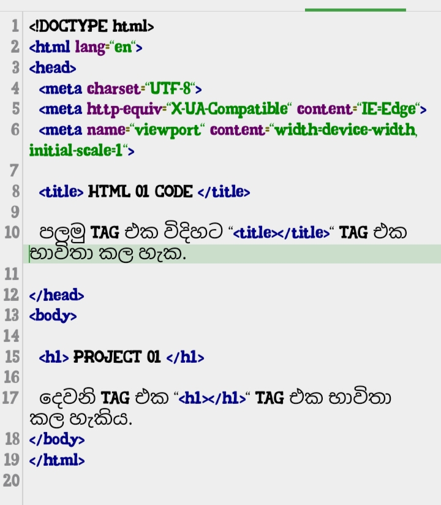

# Web-project-01

<!DOCTYPE html>

<html lang="en">

<head>

  <meta charset="UTF-8">

  <meta http-equiv="X-UA-Compatible" content="IE=Edge">

  <meta name="viewport" content="width=device-width, initial-scale=1">

  <title> HTML 01 CODE </title>

  

  <!-- HTML -->

  <!-- Custom Styles -->

  <link rel="stylesheet" href="style.css">

</head>

<body>

  <!-- Project -->

  

  <!-- HEADER-->

  <h1> 

  මෙවැනි ආකාරයට ඔබේ වෙබ්සයිට් එකේ title එක හා header එක වෙනස් කල හැකිය.

  </h1>

 

  

  

</body>

</html>

